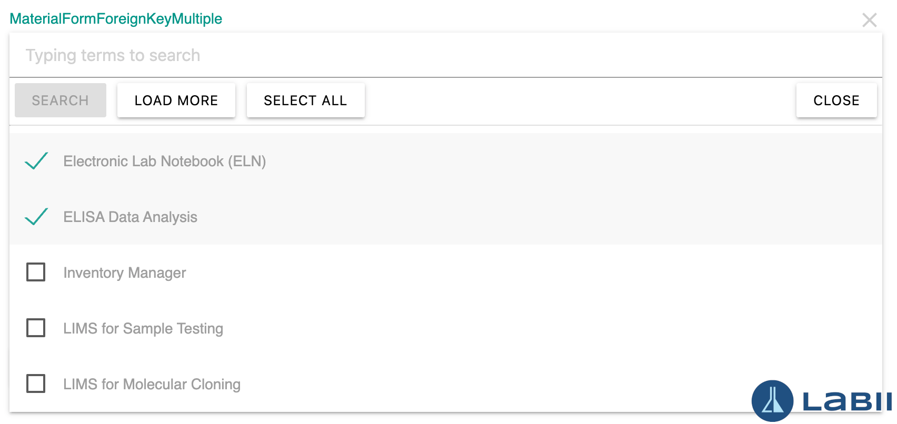

# Labii ForeignKey and ForignKeys widget

When you are documenting the data in Electronic Lab Notebook (ELN) and Laboratory Information Management System (LIMS), it is often necessary to refer to another record for clarification. For instance, if you are mentioning an experiment in your report, you may wish to show which protocol was used. One way of doing this would be with the ForeignKey or ForeignKeyMultiple widgets developed by [Labii Inc.](https://www.labii.com).

The widgets are developed using [Materialize CSS](https://materializecss.com/select.html) Select component, so it is required that the necessary packages are installed before using them.

This page is available at [https://labii.github.io/labii-widget-foreignkey/](https://labii.github.io/labii-widget-foreignkey/)

## ForeignKey
ForeignKey is a widget to make lists of data available for selection based on an API URL. In the edit mode, it enbles you to choose a record from dropdown; in the read-only mode, ForeignKey presents a clickable link for whichever value has been chosen. This tool is usually found in cases where only one piece of information needs to be referred to.


### Documentation
[https://docs.labii.com](https://docs.labii.com/widgets/column-widgets/form#foreignkey)

### Usage
1. Click the field to display the dropdown
2. Type any terms
3. Click `Search` button to search
4. Click `Load more` button to load another page of data
5. Select an option

### Configuration
* `title`, The title of the form field to be displayed
* `url`, The API URL to query the options
* `enum` and `enumNames`, The dropdown values and options
    * Leave it emtpy (`[]`) to enable the widget to query the first page as default options
* `widget`, Set the widget value as `MaterialFormForeignKey`
* `default`, The default value to be included

### Example
```javascript
foreignkey: {
    title: "MaterialFormForeignKey",
    type: "string",
    url: getAPI({
        name: 'anno',
        table: Tables["applications"],
        level: 'organization',
        sid: "ehkn0a40x1glqvAFKP",
        serializer: 'name',
        get: "page_size=5"
    }),
    enum: [],
    enumNames: [],
    widget: "MaterialFormForeignKey"
},
```

# ForeignKeyMultiple
As with the ForeignKey widget, the ForeignKeyMultiple widget allows you to select multiple records. It can be used to handle one-to-many or many-to-many relationships.


### Documentation
[https://docs.labii.com](https://docs.labii.com/widgets/column-widgets/form#foreignkeys)

### Usage
The usage is identical to the ForeignKey widget.

### Configuration
The Configuration is identical to the ForeignKey widget.

### Example
```javascript
foreignkeymulti: {
    title: "MaterialFormForeignKeyMultiple",
    type: "array",
    url: getAPI({
        name: 'anno',
        table: Tables["applications"],
        level: 'organization',
        sid: "ehkn0a40x1glqvAFKP",
        serializer: 'name',
        get: "page_size=5"
    }),
    enum: [],
    enumNames: [],
    widget: "MaterialFormForeignKeyMultiple"
},
```

## About Labii Inc.
[Labii (https://www.labii.com)](https://www.labii.com) facilitates research and development by providing a user-friendly, customizable Electronic Lab Notebook (ELN) and Laboratory Information Management System (LIMS) to document, manage, and interpret data. Labii ELN & LIMS can be configured for any type of data, and the functions can easily be enhanced and expanded by stand-alone applications. We address the unique needs of each of our customers and are the trusted provider of hundreds of biotech companies and academic labs.
